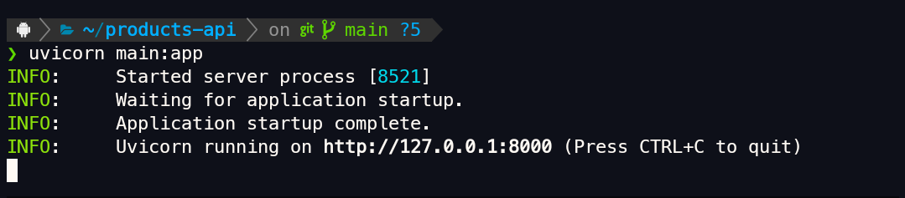
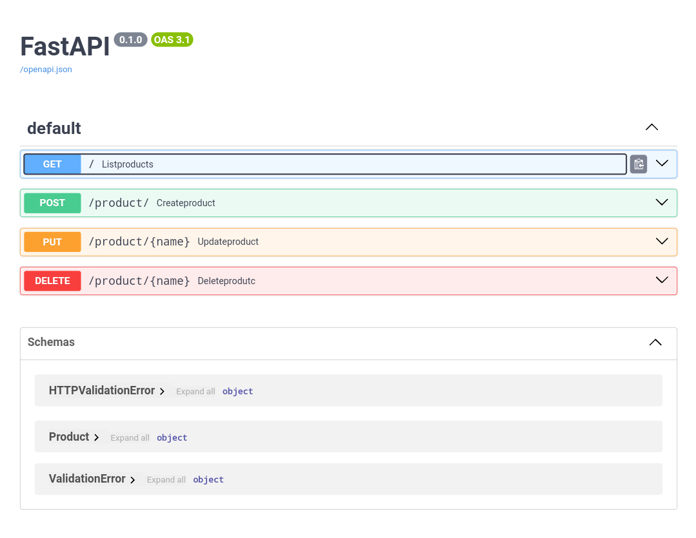

## API
Essa é uma **API** simples de gerenciamentos de produtos que permite criar, atualizar, deletar e listar produtos, ou seja, um mero c.r.u.d. .

## instalação
Pra rodar aí na tua máquina e coisa simples, basta instalar as dependências e rodar😆.
> Vou listar os passos abaixo mas espero que o python e git estejam instalados aí na tua máquina, belê.

1. Clona o projeto usando o terminal:
```shell
git clone https://gitHub.com/imalisoon/products-api
```

2. Navega até o diretório e instalar as dependências:
```shell

cd products-api/
pip install -r requirements.txt

```

3. Agora só rodar🚀:
```shell

uvicorn main:app

```

- essa será sua saída se tudo estiver correto.



Agora só acessar `http://127.0.0.1:8000/docs`




